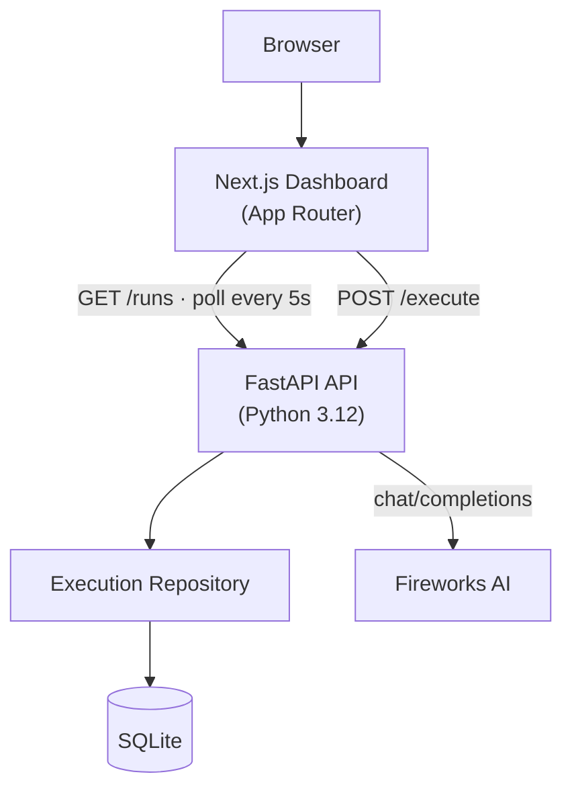

# Lysergic Control Plane

> Operational infrastructure for reliable AI execution.

[](LICENSE)
[](https://fastapi.tiangolo.com/)
[](https://nextjs.org/)
[](https://docs.docker.com/compose/)
[](https://www.sqlite.org/)
[](https://www.python.org/)
[](https://www.typescriptlang.org/)
[](https://fireworks.ai/)

**Lysergic Control Plane** is a production-oriented AI execution platform that brings
observability, persistence, and operational workflows to LLM-powered applications. It turns a
prompt into a recorded, measurable, replayable operation — not just a one-off response.

---

## Overview

Most AI demos stop at "prompt in, response out." Real systems need execution history, latency
tracking, failure visibility, and reproducible deployment. Lysergic Control Plane provides
exactly that:

- Submit a prompt through a clean operational dashboard.
- The API runs it through the Fireworks AI adapter, measures latency, and persists every
  execution to SQLite.
- The dashboard surfaces live metrics, a searchable history, per-execution detail, and a
  latency-trend chart — all polling automatically.

## Why this project?

Because reliability is a feature. This project focuses on **reliable AI execution** with three
engineering pillars:

- **Observability** — every execution is recorded with status, latency, model, and timestamp;
  the dashboard makes trends visible at a glance.
- **Reproducibility** — pinned dependencies, container-first deployment, and a deterministic
  build mean the demo runs the same on any machine.
- **Production-oriented design** — clean layering (adapter → router → repository), explicit
  error handling, structured logging, and no hidden magic.

## Features

- **AI execution pipeline** — `POST /execute` runs a prompt through Fireworks AI and returns a
  normalized result.
- **Persistent execution history** — every run (success or failure) is stored in SQLite.
- **Latency monitoring** — per-execution `latency_ms` and an aggregate average tracked live.
- **Operational dashboard** — metrics cards, execution table, detail drawer, and a native
  latency-trend chart.
- **Docker deployment** — `docker compose up --build` brings up the full stack.
- **Production-ready architecture** — FastAPI + Pydantic v2 backend, Next.js 15 frontend,
  adapter-isolated provider access.

## Architecture



- **Web** — Next.js 15 (App Router), TypeScript (strict), Tailwind CSS; an operational
  observability dashboard. Data access is centralized in `lib/api.ts`; `hooks/useExecutions.ts`
  polls `GET /runs` every 5 seconds.
- **API** — FastAPI, Pydantic v2, Uvicorn. All provider communication is isolated in
  `services/fireworks.py`; routers depend only on that adapter and the repository.
- **Data** — SQLite via the Python standard library; all SQL lives in `app/repository/`.
- **Platform** — Docker Compose orchestrates both services, with a healthcheck and a named
  volume for the database.

## Quick Start

### Local (without Docker)

Backend:

```bash
cd apps/api
pip install -r requirements.txt -r requirements-dev.txt
uvicorn app.main:app --reload --port 8000
```

Frontend (separate terminal):

```bash
cd apps/web
npm install
npm run dev
```

Open http://localhost:3000. Set `FIREWORKS_API_KEY` in the environment before running the
backend so executions reach the provider.

### Docker

```bash
cp .env.example .env        # set FIREWORKS_API_KEY
docker compose up --build
```

- API: http://localhost:8000 (interactive docs at `/docs`)
- Web: http://localhost:3000

### Codespaces / public deployment

To run the stack where the dashboard is opened from a different machine (e.g. GitHub Codespaces or a
phone), set two variables before building so the web client calls the **public** backend URL and the
API accepts the forwarded web origin:

```bash
export WEB_API_URL="https://<codespace>-8000.app.github.dev"
export CORS_ORIGINS="http://localhost:3000,http://web:3000,https://<codespace>-3000.app.github.dev"
docker compose up --build
```

Then make ports **3000** and **8000** _Public_ in the Codespaces Ports panel. `CORS_ORIGINS` is not
prefixed; `WEB_API_URL` is injected into the web image at build time.

## Environment Variables

API settings use the `APP_` prefix. Provider credentials use the unprefixed `FIREWORKS_*` names. The
web client uses `NEXT_PUBLIC_API_URL` (inlined at build time). `CORS_ORIGINS` and `WEB_API_URL` are
deployment-only overrides read by `docker-compose.yml`.

| Variable | Scope | Default | Purpose |
| --- | --- | --- | --- |
| `APP_ENVIRONMENT` | API | `development` | Runtime environment. |
| `APP_API_HOST` / `APP_API_PORT` | API | `0.0.0.0` / `8000` | Bind address. |
| `APP_CORS_ORIGINS` | API | `*` | Comma-separated allowed origins. |
| `CORS_ORIGINS` | Compose | `http://localhost:3000,http://web:3000` | Allowed CORS origins when deployed (overrides `APP_CORS_ORIGINS`). |
| `APP_DATABASE_URL` | API | `sqlite:///./lysergic.db` | SQLite connection URL. |
| `APP_LOG_LEVEL` | API | `INFO` | Log level. |
| `FIREWORKS_API_KEY` | API | _(empty)_ | Fireworks AI API key. |
| `FIREWORKS_MODEL` | API | `accounts/fireworks/models/gpt-oss-120b` | Model name. |
| `FIREWORKS_TIMEOUT` | API | `30` | Provider request timeout (seconds). |
| `NEXT_PUBLIC_API_URL` | Web | `http://localhost:8000` | API base URL (inlined at build). |
| `WEB_API_URL` | Compose | `http://localhost:8000` | API base URL baked into the web image. |

## API

| Method | Path | Description |
| --- | --- | --- |
| `GET` | `/health` | Service health check. |
| `POST` | `/execute` | Run a prompt through Fireworks AI and persist the execution. |
| `GET` | `/runs` | List the latest executions (most recent first). |
| `GET` | `/runs/{id}` | Fetch a single execution by id. |

`POST /execute` request:

```json
{ "prompt": "Explain AMD ROCm in one sentence." }
```

`POST /execute` response (success):

```json
{
  "id": "9f2c…",
  "prompt": "Explain AMD ROCm in one sentence.",
  "response": "ROCm is AMD's open GPU compute platform…",
  "model": "accounts/fireworks/models/llama-v3p1-8b-instruct",
  "latency_ms": 412,
  "status": "success",
  "created_at": "2026-07-10T22:00:00.000000+00:00"
}
```

On a provider failure the API persists an `error` execution and returns `502`, so the
dashboard can show failures in history.

## Project Structure

```
.
├── apps/
│   ├── api/                 # FastAPI service
│   │   ├── app/
│   │   │   ├── main.py
│   │   │   ├── config.py
│   │   │   ├── database.py
│   │   │   ├── logging.py
│   │   │   ├── health.py
│   │   │   ├── models/
│   │   │   ├── schemas/
│   │   │   ├── services/     # fireworks.py adapter
│   │   │   ├── repository/   # SQLite access
│   │   │   └── routers/
│   │   └── tests/
│   └── web/                 # Next.js dashboard
│       ├── app/
│       ├── components/       # dashboard/ metrics/ executions/ shared/
│       ├── hooks/            # useExecutions.ts
│       └── lib/              # api.ts, metrics.ts, types.ts
├── packages/                # reserved for shared code (intentionally empty)
├── docs/                    # MASTER_PLAN, ARCHITECTURE, TASKS, DECISIONS
├── docker/                  # Docker helpers
├── .github/workflows/       # CI
├── docker-compose.yml
├── Makefile
└── README.md
```

## Development

```bash
make install-api   # install Python deps
make install-web   # install frontend deps
make dev-api       # run API with hot reload
make dev-web       # run web with hot reload
make test          # run API tests
make lint          # ruff + next build
make build         # docker compose build
make up            # docker compose up
make logs          # tail logs
```

## Testing

```bash
cd apps/api && pytest      # repository + execute endpoint (Fireworks mocked)
```

The CI pipeline runs `ruff`, `pytest`, and `next build` on every push/PR.

## Roadmap

- **Sprint 0 — Foundation**: scaffold, `/health`, dashboard, Docker, CI. _(done)_
- **Sprint 1 — AI Execution**: Fireworks adapter + `/execute`, `/runs`, SQLite persistence. _(done)_
- **Sprint 2 — Observability**: live metrics, history, detail drawer, latency chart, polling. _(done)_
- **Sprint 3 — Polish**: documentation, diagrams, screenshots, demo, submission. _(done)_

Future (post-submission) ideas:

- **Multi-provider routing** — swap or fall back between inference providers.
- **Local ROCm inference** — run models on AMD Instinct GPUs without a hosted API.
- **Execution replay** — re-run a past execution deterministically.
- **Team workspaces** — shared dashboards and access control.
- **Metrics API + OpenTelemetry** — first-class telemetry and tracing.

## Hackathon Track

Submitted to the **AMD Developer Hackathon — Unicorn Track**.

## AMD Technologies Used

- **AMD Developer Cloud** — target deployment environment for the containerized stack.
- **Fireworks AI API** — inference provider (served on AMD Instinct GPUs).
- **Containerized deployment** — Docker Compose for reproducible, cloud-ready runs.
- **Cloud-ready architecture** — stateless API + volume-backed SQLite, ready to lift into a
  managed container platform.

## Screenshots

| View | File |
| --- | --- |
| Dashboard overview | `docs/screenshots/dashboard.png` |
| Prompt execution in progress | `docs/screenshots/execute.png` |
| Execution history populated | `docs/screenshots/history.png` |
| Execution detail drawer | `docs/screenshots/detail.png` |

Capture them with the running stack:

```bash
docker compose up -d
node docs/screenshots/capture.mjs     # requires: npm i -D playwright && npx playwright install chromium
```

## License

[MIT](LICENSE)
